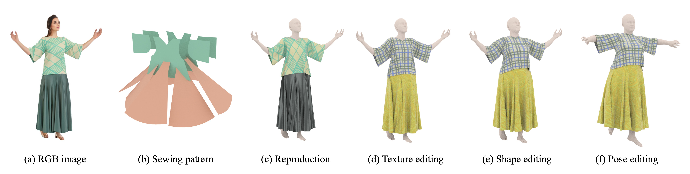

# Sewformer
This is the official implementation of [Towards Garment Sewing Pattern Reconstruction from a Single Image](https://arxiv.org/abs/2311.04218v1).

[Lijuan Liu](https://scholar.google.com/citations?user=nANxp5wAAAAJ&hl=en)<sup> *</sup>,
[Xiangyu Xu](https://xuxy09.github.io/)<sup> *</sup>,
[Zhijie Lin](https://scholar.google.com/citations?user=xXMj6_EAAAAJ&hl=zh-CN)<sup> *</sup>,
[Jiabing Liang]()<sup> *</sup>,
[Shuicheng Yan](https://yanshuicheng.info/)<sup>&dagger;<sup></sup>,  
ACM Transactions on Graphics (SIGGRAPH Asia 2023)

### [Project](https://sewformer.github.io/) | [Paper](https://arxiv.org/abs/2311.04218v1)



---------------------------

### Installation and Configuration
* We provide an conda env yaml file and the runtime environment can be initialized with`conda env create -f environment.yaml`
* Clone this repository to `path_to_dev` and `cd path_to_dev/Sewformer`, download the pre-trained [checkpoint]((https://huggingface.co/liulj/garment)) and put it into `assets/ckpts`, then activate the environment `conda activate garment`. 

### Training
* Download our provided [dataset]() or **generate your dataset according to [Sewfactory](./Sewfactory/ReadMe.md)** and put it into `path_to_sewfactory`, update the local paths in `system.json` to make sure the dataset setup correctly. Train the model with
`torchrun --standalone --nnodes=1 --nproc_per_node=1 train.py -c configs/train.yaml`
The test results will be located at the `output` in `system.json`.

### Testing

1. Inference sewing patterns with the trained model or our pretrained model:
* for in-the-wild images:
    `python inference.py -c configs/test.yaml -d assets/data/real_images -t real -o outputs/real` 

* for deepfashion dataset:
    `python inference.py -c configs/test.yaml -d assets/data/deepfashion -t deepfashion -o outputs/deepfashion` 

2. Simulate the predicted results (Windows):
`cd path_to_dev/SewFactory` and run `path_to_maya\bin\mayapy.exe .\data_generator\deepfashion_sim.py` to simulate the predicted sew patterns. (Please prepare the SMPL prediction results with [RSC-Net](https://github.com/xuxy09/RSC-Net) and update the predicted data root specified in `deepfashion_sim.py`.)


### BibTex
Please cite this paper if you find the code/model helpful in your research:
```
 @article{liu2023sewformer,
    author      = {Liu, Lijuan and Xu, Xiangyu and Lin, Zhijie and Liang, Jiabin and Yan, Shuicheng},
    title       = {Towards Garment Sewing Pattern Reconstruction from a Single Image},
    journal     = {ACM Transactions on Graphics (SIGGRAPH Asia)},
    year        = {2023}
  }
```


